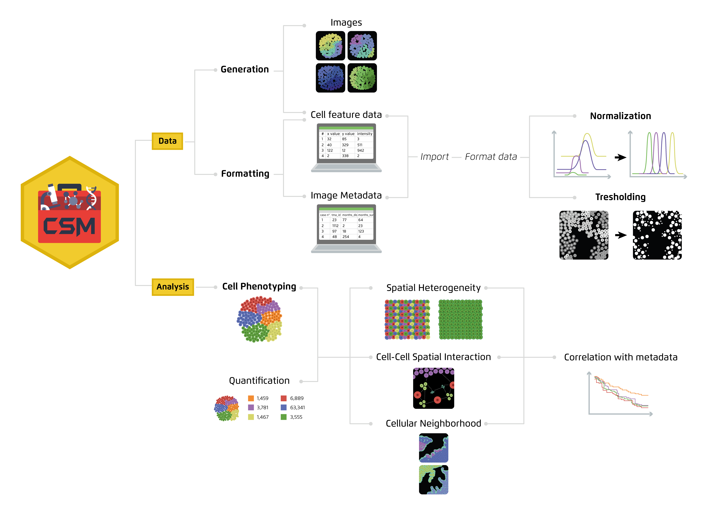

#  Comprehensive Spatial Methods (CSM) 
**Summary:** CSM is a R developed toolbox to analyze spatially resolved tissue data. To see a demo of CSM capabilities please see related [*publication*](publicationURL).



## What you will find in this Repository (Folder description)
[Requirements and installation](#Main features and requirements) 
[Main CSM scripts](#CSM scripts) 
[Publication associated datasets](#Publication) 
[Image Bank](#Images) 
[Citation](#Images) 

## Main features and requirements
* CSM is not an R package
* CSM is delivered to the user as a R script containing functions and a script describing examples of use
* CSM has been developed using R version 4.3 and above
* CSM requires manual installation of several R packages (see User Code script for further details)

## CSM scripts
This folder contains the CSM source code (containing code for all required CSM functions) and the CSM user code (Containing examples of use. In addition a test dataset containing features of XXX endometrial carcinoma cells can also be found in this folder.

#Publication
This folder contains the CSM scripts and datasets to replicate the results of our [*publication*](publicationURL).

#Images
This folder contains several test images used in the related [*publication*](publicationURL).


## Citation
Please cite this paper in case our method or parts of it were helpful in your work.
```diff
@article{XXX,
  title={XXX},
  author={XXX},
  journal=XXX},
  year={XXX}
}
```